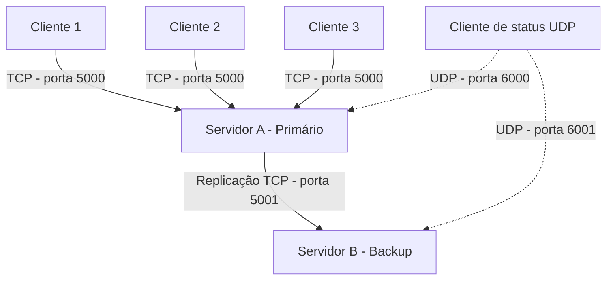

# Sistema Distribuído de Reservas

Atividade prática da disciplina de Programação Concorrente e Distribuída do IFSC - Câmpus Gaspar.

## Integrantes

- Guilherme Di Fante

## Objetivo

O projeto implementa um sistema distribuído para reserva de assentos. O sistema utiliza comunicação TCP para as operações principais, UDP para consulta rápida de status, múltiplas threads para atendimento simultâneo e uma estratégia de replicação primária-backup.

O projeto também permite comparar o funcionamento com e sem sincronização, demonstrando experimentalmente uma condição de corrida.

## Funcionalidades

- Listagem dos assentos disponíveis;
- reserva de um assento;
- cancelamento de uma reserva;
- consulta das reservas realizadas;
- consulta de status por TCP e UDP;
- atendimento de múltiplos clientes;
- teste automático com 30 requisições concorrentes;
- execução com e sem sincronização;
- replicação do estado;
- reconexão automática após a queda da primária;
- tratamento da desconexão inesperada de clientes.

## Tecnologias utilizadas

- Java;
- ServerSocket e Socket;
- DatagramSocket e DatagramPacket;
- threads;
- synchronized;
- CountDownLatch;
- AtomicInteger e AtomicLong;
- Git e GitHub.

## Estrutura do projeto

```text
src/
├── cliente/
│   ├── ClienteReservas.java
│   └── ClienteStatusUdp.java
├── comum/
│   └── Protocolo.java
├── servidor/
│   ├── GerenciadorReservas.java
│   ├── ServidorReservas.java
│   └── ServidorStatusUdp.java
└── testes/
    └── TesteConcorrencia.java
```

## Diagrama da arquitetura



O Servidor A funciona inicialmente como réplica primária e recebe as solicitações dos clientes. Cada cliente TCP é atendido por uma thread separada. Após uma reserva ou um cancelamento, a alteração é enviada ao Servidor B, que funciona como backup. Se o Servidor A parar de funcionar, os clientes tentam se conectar ao Servidor B, que é promovido e passa a atender como servidor principal.